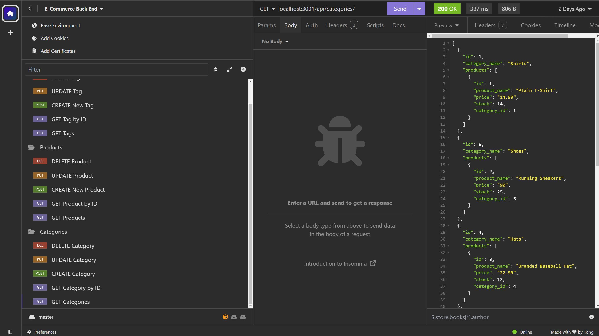
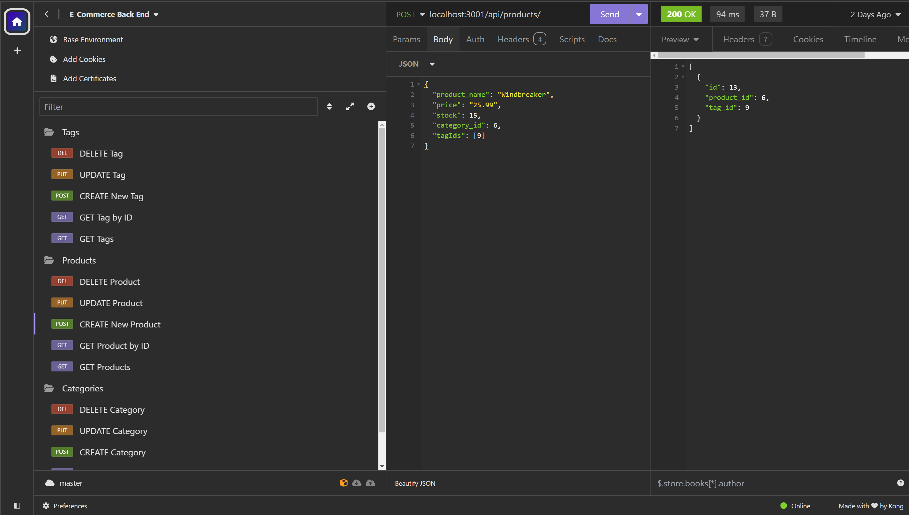

# ORM- E-Commerce Back End

## Description

The motivation for this application was to use starter code in order to develop the back end for an e-commerce site. By creating the express API routes, I could utilize Sequelize and have it communicate with a PostgreSQL database. This allows the user to retrieve their e-commerce data and add, update, and delete data from the database. This project allowed me to gain more experience with Sequelize and also get it to interact with the PostgreSQL database.

## Usage

The user can connect to the Sequelize database after creating environment variables for their PostgreSQL username, password, and database name. Once they are connected, the user can run the seed command to input the seed test data into the database. The user can then start the application by using the npm start command which will start the server and sync the Sequelize models to the PostgreSQL database. The user can then use Insomnia to open the GET routes for categories, products, and tags. They can also use the POST, PUT, and DELETE routes to create, update, and delete the data in the database. 

<a href="https://drive.google.com/file/d/1n0Ec_MoIueP6wkZfaSAfPEGDCPg6A8hk/view?usp=sharing">Walkthrough Demo</a>

